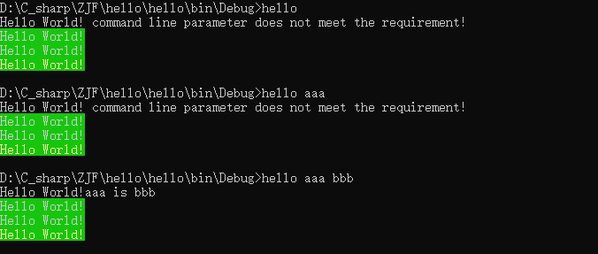

# hello
use ResetColor() to restore the console background color and foreground color, or use ConsoleColor to save the background color and foreground color and restore them before the program return 
# the program result
